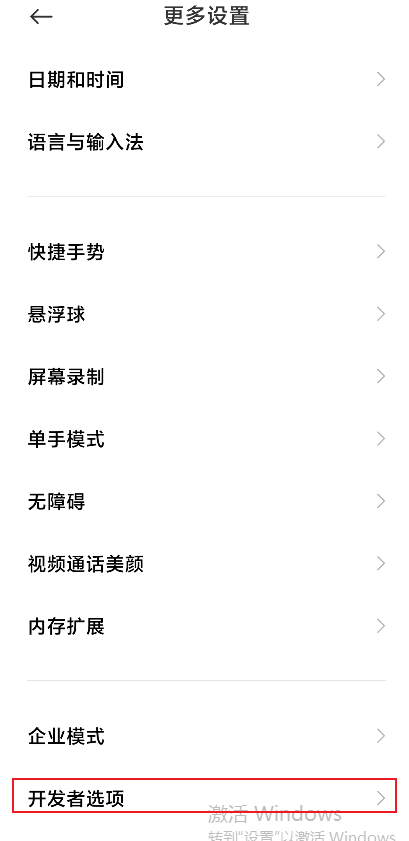

# 安卓刷机篇
## 刷机方式

#### 线刷
- 线刷包 工厂镜像包
  - bootloader(fastboot),radio,image
    - vender.img 驱动
    - system_other.img, system.img 系统分区
    - boot.img linux内核
#### 卡刷
- 刷完之后需要双清、三清、四清等
- 卡刷包 OTA全量包/OTA增量包
- 
## 手机 
#### Redmi Note 11 Pro
- 参考文档:
  - [给小米/红米手机root（工具基本都是官方的）——magisk篇](https://blog.csdn.net/weixin_73636162/article/details/134043402)
##### ADB调试
- 启动adb调试
  - 设置 -> 我的设备 -> 全部参数 -> MIUI版本(连续点击,进入开发者模式)
  
  
  
  - 更多设置 -> 开发者选项
  
  
  - 开发者选项
    - 包含开启开发者选项，OEM解锁，Bootloader锁的状态查看(设备解锁状态)
    
    - USB调试，USB安装
      - 在开启USB安装时，会检测SIM卡
    
    - Bootloader解锁
      - 前往[官网](https://www.miui.com/unlock/index.html)下载解锁工具
        - 注意解锁工具需要绑定小米账号，同时还需要手机登录小米账号大于7天
        - 解锁工具目前不能在windows11运行
      - 小米手机关机之后，长按电源键+音量下键,进入bootloader模式
      - 使用小米解锁工具进入解锁模式，此时在开机查看设置中设备解锁状态为已解锁
        
  - 开启Root
    - [官网](https://xiaomirom.com/)下载刷机镜像包
    - 手机开启USB调试和安装，连接电脑,电脑端输入adb devices,确保手机连接成功
    ```bash
    adb devices
    ```
    - 下载[Magisk](https://github.com/topjohnwu/Magisk)
    - 电脑端输入
    ```bash
    adb install Magisk(电脑端路径)
    ```
    - 解压缩下载的镜像文件
    - 使用Magisk修复boot.img，手机进入fastboot,刷入镜像文件，重启手机需要5-10分钟

#### Pixel 6
- 下载对应版本的安卓镜像，[Android镜像地址](https://developers.google.com/android/images?hl=zh-cn)
- 参考文档
  - [官方刷机教程](https://source.android.com/docs/setup/test/running?hl=zh-cn)
  - [小肩膀教程](https://mp.weixin.qq.com/s/1EySfXSucGdiuEBTfLsymA)
##### Pixel 6遇到的网络连接问题
- 手动修改手机时间
- 参考文档
  - [重述：如何修复 Android 手机上的 SSL 连接错误](https://www.thesslstore.com/blog/fix-ssl-connection-errors-android-phones/)
- 自动设置
```bash
adb shell "settings put global ntp_server pool.ntp.org"
```

## WIFI信号问题
- adb shell settings put global captive_portal_mode 0
  - 把 Android 的“网络检测模式”设置为 禁用，这样系统就不会去探测网络可用性，也不会弹出 WiFi 登录认证提示。