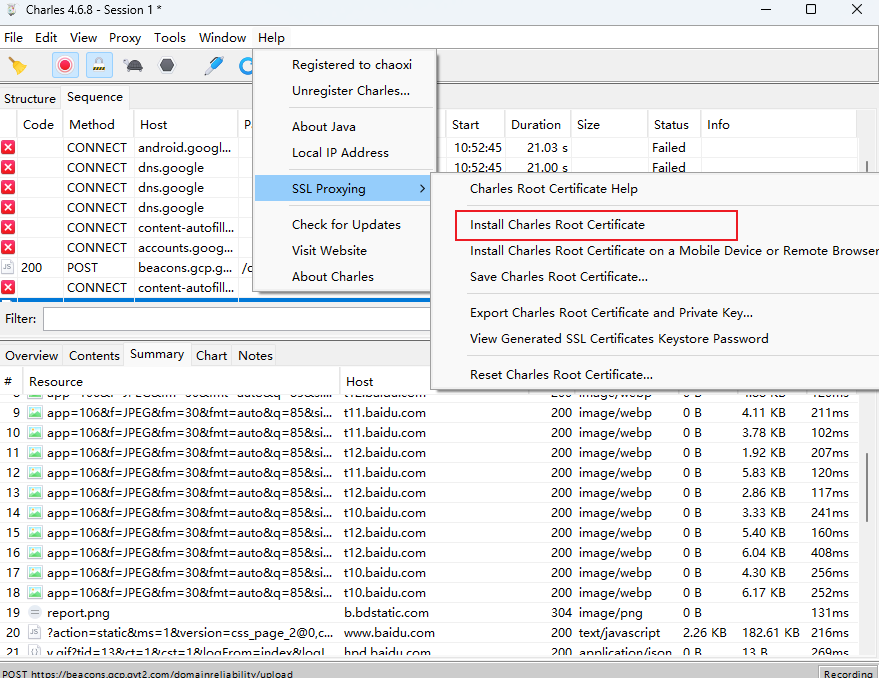
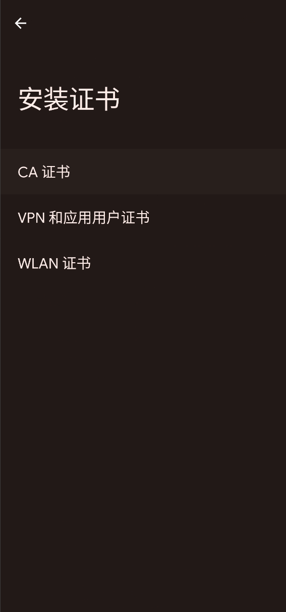

# 抓包工具篇
### 抓包工具分类
- 全局抓包工具
  - Http v7,Http debugger pro
- 代理抓包工具
  - Charles,Fiddler
- VPN 抓包工具
  - HttpCanary
- 网卡抓包工具
  - WireShark
- 手机抓包工具
  - tcpdump
- Hook抓包工具
  - r0Capture
#### Charles的安装和配置
- [官网](https://www.charlesproxy.com/download/)下载
- [注册网站](https://www.zzzmode.com/mytools/charles/)
- socksdroid的安装和配置
  - 将手机和电脑保证在同一网段，可以Ping通，设置socksdroid的配置IP和Port连接Charles的设置
  - IP： Http -> Local Ip Address
    
  - Port: Proxy -> Proxy Settings
    
- 设置SSL
  - Proxy -> SSL Proxying Settings
  - 启用Enable SSL Proxying
  
  - 配置SSL证书
  - 方式一:
    
  - 方式二:
    
- Windows11电脑下载charles5.0.3版本无法安装，暂不知道什么问题
- 两台机器(手机，电脑)想要网络ping通需要关闭电脑的公用网络防火墙
#### 安卓CA证书
- 用户证书
  - /data/misc/user/0/cacerts-added
- 系统证书
  - /etc/security/cacerts
- Android7之后系统只信任系统证书，需要把用户证书移动到系统证书下面
- 需要利用Magisk的Move Certificates模块
###### pixel6的Charles的证书配置过程
- 安装charles，之后在电脑端配置charles证书
  
  
  
  
- 手机端安装证书，保存证书到电脑本地
  
  - 将证书推送到手机
    ```bash
    adb push (证书地址) (推送手机路径)
    ```
  - 手机打开(设置 -> 安全和隐私 -> 更多安全和隐私设置)
     
  - 安装证书(加密与凭据 -> 安装证书 -> CA证书)，选择相关证书安装
    
    - 可以在用户凭据查看安装的证书
      
    - 同时在(可信凭据 -> 用户)下面也可以看到
      
  - Magisk安装[MoveCertificate](https://github.com/ys1231/MoveCertificate)模块
    - 先将模块压缩包下载到电脑本地，再推送到手机
    - 使用已经root的手机的Magisk安装这个模块，重启手机
      
    - 查看上述设置中的(用户凭据 -> 系统)即可发现证书已经安装到系统证书
      
     
