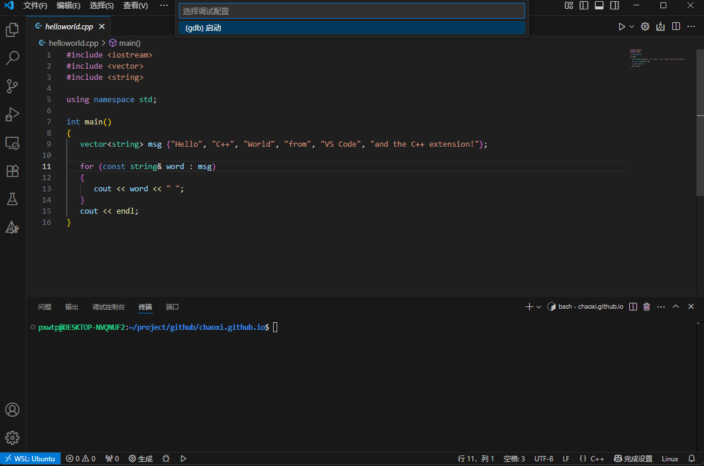
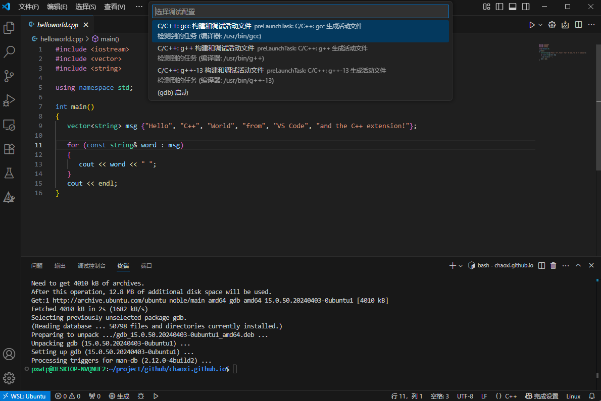

## C++调试

### 使用插件
- C/C++
- C/C++ Extension Pack
- C/C++ Themes
- CMake Tools

### debug/run
- 问题：


- 原因: 没有安装gdb

- 解决方案：
```bash
sudo apt update
sudo apt install gdb
```

- 效果:


- 相关链接
    - https://blog.csdn.net/qq_43762434/article/details/141034493
